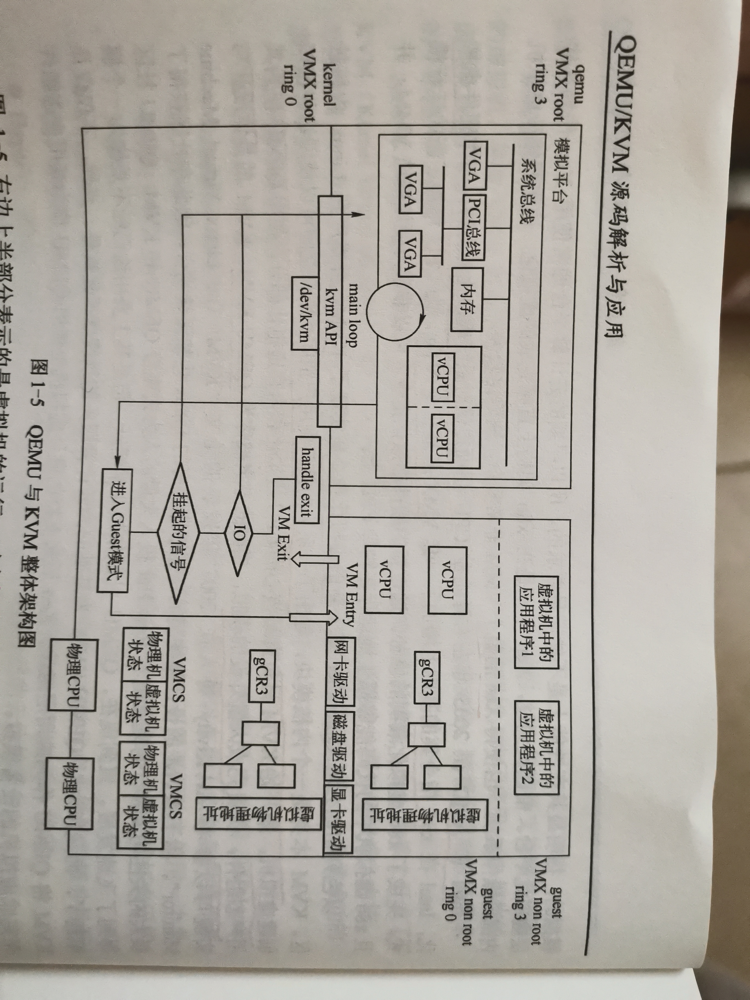

# qemu_kvm learning

# Chapter  1. Qemu与KVM概述

## 1.1 虚拟化简介

### 1.1.1 虚拟化思想

虚拟化的主要思想:通过分层将底层复杂的、难用的资源虚拟抽象成简单的、易用的资源,提供给上层使用.

```
wine项目:让为windows编写的程序运行在linux上;
cygwin项目:让为linux编写的程序运行在windows上.
```

### 1.1.2 虚拟化简介

#### 1.1.2.1 进程

进程有自己独立的进程地址空间以及独立的CPU和寄存器,执行程序员编写的指令,完成一定的任务.因此,进程可以看成是一个独立的虚拟机.

```
1.一个进程在执行指令、访问内存的时候并不会影响其他进程;
2.每个进程都认为自己拥有整个机器;
3.进程的指令都是可以直接运行在硬件CPU上.
```

#### 1.1.2.2 模拟器

模拟器可以将为一种硬件指令集(ISA:Instruction Set Architecture)编译的程序运行在另一种硬件指令集上.

```
比如:应用程序在源ISA(e.g. ARM)上被编译出来,在模拟器的帮助下,运行在不同的目标ISA(e.g. x86)上.
```

模拟器有两种实现方式:

```
1.通过解释来实现:对程序的源ISA指令一条一条进行分析,然后执行相应的目标ISA指令;
2.通过二进制翻译实现:将程序中所有的源ISA指令全部翻译成目标ISA上具有相同功能的指令,然后在目标ISA指令机器上执行.
```

典型的模拟器:Qemu(Quick Emulator)的用户态程序模拟、Bochs模拟器等.

#### 1.1.2.3 高级语言虚拟机

高级语言虚拟机通常会定义一种全新的虚拟ISA,并在其中定义新的指令集、数据操作、寄存器的使用等类似物理ISA中的规范.其翻译过程为:

```
高级语言虚拟机源程序--->编译器--->字节码(编译器将源程序编译为虚拟ISA构成的字节码)
--->windows/linux平台虚拟机--->windows/linux OS.
```

虚拟机:用于将虚拟ISA指令转换为物理ISA指令.

典型的高级语言虚拟机:JVM虚拟机、Python虚拟机等.

#### 1.1.2.4 系统虚拟机

系统虚拟机能够提供一个完整的系统环境.

```
1.能够运行多个用户的多个进程;
2.通过系统虚拟化技术,能够在单个的宿主机硬件平台上运行多个虚拟机,每个虚拟机有着完整的虚拟机硬件(e.g.虚拟的CPU、内存、外设的);
3.虚拟机之间能够实现完整的隔离.
```

VMM(Virtual Machine Monitor,虚拟监控器):管理全局物理资源的软件.

```
VMM之于虚拟机就如同OS之于进程,VMM利用时分复用或空分复用的方法将硬件资源在各个虚拟机之间进行分配.
```

典型的系统虚拟化解决方案:VMware Workstation、Qemu、VirtualBox和HyperV等.

### 1.1.3 系统虚拟化的历史

KVM(Kernel Virtual Machine):2006年以色列初创公司(Qumranet)利用Intel的硬件虚拟化技术在Linux内核上开发了KVM,RedHat后来收购了Qumranet.

```
KVM具有架构精简、与Linux天然融合的优点.现在是一个非常成功的虚拟化VMM,广泛应用于各种开源云平台上,成为云计算的基石.
```

系统虚拟化方案介绍:

```
1.VMware Workstation:有大量用户,用户可以非常方便的在PC上构建一个虚拟机,安装各种OS;
2.VirtualBox:最早由德国公司开发,后来被甲骨文收购.优点是性能不错、开源.但是不如VMware Workstation稳定;
3.HyperV:微软提供的虚拟化解决方案,微软用它来构建自己的云计算平台;
4.Xen:早期的开源虚拟化方案,出现在各种硬件虚拟化技术之前,其发展不如KVM.
```

## 1.2 Qemu与KVM架构介绍

### 1.2.1 Qemu与KVM历史

#### 1.2.1.1 早期的Qemu

Qemu最开始是由法国程序员Fabrice Bellard开发的一个模拟器.Qemu能够完成用户程序模拟和系统虚拟化模拟.

```
1.用户程序模拟:Qemu能够将为一个平台编译的二进制文件运行在另一个不同的平台上:
	e.g. 一个ARM指令集的二进制程序,通过Qemu的TCG(Tiny Code Generator)引擎处理后,ARM指令被转换成TCG中间代码,
		然后再转换成目的平台的代码进行运行.
2.系统虚拟化模拟:指Qemu能够模拟一个完整的系统虚拟机:
	1.该虚拟机有自己的虚拟CPU、芯片组、虚拟内存以及各种外部设备;
	2.为虚拟机中运行的OS和应用程序呈现出与物理机完全一致的硬件视图.
```

Qemu能够模拟的平台包括:x86、ARM、MIPS、PPC等.早期的Qemu都是通过TCG来完成各种硬件平台的模拟,所有的虚拟机指令都需要经过Qemu的转换(全部由软件来实现).

#### 1.2.1.2 Qemu+KVM

Intel和AMD再2005年左右开始在CPU层面提供对系统虚拟化的支持(即:硬件虚拟化).

```
Intel在x86指令集的基础上增加了一套VMX扩展指令VT-x(即:硬件虚拟化指令).
```

KVM由以色列初创公司Qumranet基于新的硬件虚拟化指令集实现了KVM,并推广到linuxn内核社区.

```
1.KVM本身是一个内核模块,导出了一系列的接口到用户空间,用户空间可以使用这些接口创建虚拟机;
2.刚开始的KVM只负责最核心的CPU虚拟化和内存虚拟化部分(后面其他部分也有可能实现了),使用Qemu作为其用户态组件,负责完成大量
	外设的模拟.--->即KVM+Qemu方案.
```

### 1.2.2 Qemu+KVM架构



主要分为3个部分:

```
1.VMX root模式的应用层(左上半部分):宿主机的应用层,运行包括Qemu在内的普通进程;
2.VMX root模式的内核层(下半部分):宿主机的内核层,运行宿主机的操作系统内核;
3.VMX non-root模式(右上半部分):虚拟机模式,运行虚拟机中的用户程序和操作系统内核.
```

#### 1.2.2.1 VMX root模式的应用层(左上半部分)

主要特点:

```
1.Qemu在初始化的时候会创建模拟的芯片组,创建CPU线程来表示虚拟机的CPU执行流;
2.在Qemu的虚拟地址空间中分配空间作为虚拟机的物理地址;
3.根据用户在命令行指定的设备为虚拟机创建对应的虚拟设备;
4.在虚拟机运行期间,Qemu会在主线程中监听各种事件(e.g. 虚拟机对设备的I/O访问等),并在收到这些事件后调用预先定义好的函数进行处理.
```

#### 1.2.2.2 VMX non-root模式(右上半部分)

VMX non-root模式表示虚拟机的运行.主要特点:

```
1.对虚拟机本身而言,也有自己的应用层和内核层,只不过都是VMX non-root下的;
2.Qemu和KVM对于虚拟机中的OS是透明的;
3.虚拟机中的一个CPU对应于Qemu进程中的一个线程,通过Qemu和KVM的相互协作,这些线程会被宿主机OS正常调度,直接执行虚拟机中的代码;
4.虚拟机中的物理内存对应于Qemu进程中的虚拟内存,虚拟机中的OS有自己的页表管理,完成虚拟机中的虚拟地址到虚拟机中的物理地址的转换;
5.虚拟机中的设备是通过Qemu呈现给它的,OS在启动的时候进行设备枚举,加载对应的驱动;
6.在运行过程中,虚拟机中的OS会通过设备的I/O端口(Port I/O)或者MMIO(Memory Mapped I/O)进行交互,KVM会截获这个请求,大多数时候
	KVM会将请求分发给用户空间的Qemu进程中,由Qemu处理这些I/O请求.
```

#### 1.2.2.3 VMX root模式的内核层(下半部分)

