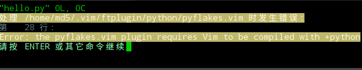
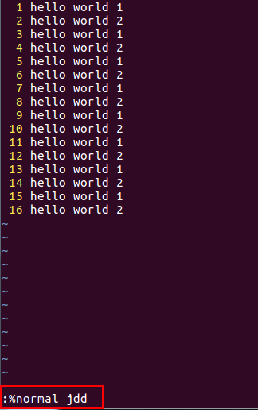
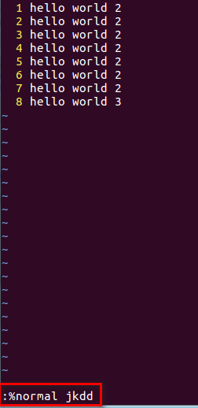

# vim使用技巧

## Chapter 1.vim配置

[一个超强的vim配置文件参考](https://github.com/ma6174/vim)

### 1.1 安装

**1.简易安装方法--->自动化安装,推荐的方法** 

	wget -qO- https://raw.githubusercontent.com/ma6174/vim/master/setup.sh | sh -x
	/*
		1.该命令行的作用:从网址上下载内容,并直接执行.
		2.wget参数:
			-q/--quite:安静模式(无信息输出);
			-O:将网上的文档内容写入xxx;
			wget -qO download.txt https://raw.githubusercontent.com/ma6174/vim/master/setup.sh
			//以安静模式将文档内容写入download.txt文件中.
			-qO-:应该是表示下载下来文档内容直接执行.
		3.sh -x:-x选项表示跟踪并调试shell脚本.
		4.网址:
			其实是:https://github.com/ma6174/vim/blob/master/setup.sh在该网页中选择Raw方式,即
			纯文本(不带格式).这样可以将github文档中的内容直接下载到文件中或者执行.
	*/
	PS:打开上面网址,其内容为:
		#!/bin/bash
		echo "安装将花费一定时间，请耐心等待直到安装完成^_^"
		if which apt-get >/dev/null; then
			sudo apt-get install -y vim vim-gnome ctags xclip astyle python-setuptools
			python-dev git
		elif which yum >/dev/null; then
			sudo yum install -y gcc vim git ctags xclip astyle python-setuptools python-
			devel	
		fi
		
		##Add HomeBrew support on  Mac OS
		if which brew >/dev/null;then
		    echo "You are using HomeBrew tool"
		    brew install vim ctags git astyle
		fi
		
		sudo easy_install -ZU autopep8 
		sudo ln -s /usr/bin/ctags /usr/local/bin/ctags
		mv -f ~/vim ~/vim_old
		cd ~/ && git clone https://github.com/ma6174/vim.git
		mv -f ~/.vim ~/.vim_old
		mv -f ~/vim ~/.vim
		mv -f ~/.vimrc ~/.vimrc_old
		mv -f ~/.vim/.vimrc ~/
		git clone https://github.com/gmarik/vundle.git ~/.vim/bundle/vundle
		echo "ma6174正在努力为您安装bundle程序" > ma6174
		echo "安装完毕将自动退出" >> ma6174
		echo "请耐心等待" >> ma6174
		vim ma6174 -c "BundleInstall" -c "q" -c "q"
		rm ma6174
		echo "安装完成"

**2.手动安装**

没试验过,不知道ok不.但是和前面自动安装步骤是一样的.

	1.安装vim sudo apt-get install vim
	2.安装ctags：sudo apt-get install ctags
	3.安装一些必备程序：sudo apt-get install xclip vim-gnome astyle python-setuptools
	4.python代码格式化工具：sudo easy_install -ZU autopep8
	5.sudo ln -s /usr/bin/ctags /usr/local/bin/ctags
	6.clone配置文件：cd ~/ && git clone git://github.com/ma6174/vim.git
	7.mv ~/vim ~/.vim
	8.mv ~/.vim/.vimrc ~/
	9.clone bundle 程序：git clone https://github.com/gmarik/vundle.git ~/.vim/bundle/vundle
	10.打开vim并执行bundle程序:BundleInstall
	11.重新打开vim即可看到效果

### 1.2 该vim的特点

	1.F5可以编译并执行C/C++/python/java/shell等脚本,F8可进行C/C++代码调试;
	2.C/C++自动插入头文件(文件名/作者/mail/创建时间以及"#ifndef...#define...#endif"等);
		PS:必须执行"gvim/vim test.h"才会有效果,先touch是不行的;
	3.python自动插入"#!/usr/bin/env python, # coding=utf-8";
		PS:必须执行"gvim/vim test.py"才会有效果,先touch是不行的;
	4.映射"Ctrl+A"为全选并复制快捷键,方便复制代码;
	5.F2消除代码中的空行(所有的空行);
	6.F3列出当前文件目录,打开树状文件目录;
	7.支持鼠标选择、方向键移动;
	8.代码高亮、自动缩进、显示行号、显示状态行的;
	9.TAB键触发代码补全功能;
	10.[]/{}/()/""/''等自动补全.

### 1.3 多窗口操作

	在编辑的文件中:
	:sp+文件名--->打开一个新文件,两个文件水平分割窗口;
	:vs+文件名--->打开一个新文件,两个文件垂直分割窗口;
	ctrl+w--->在窗口间切换.

***

## Chapter 2.vim中的问题解决

### 2.1 pyflakes.vim出现错误提示

pyflakes.vim是一个非常好用的python高亮vim插件.

在使用vim编写python脚本时,出现了需要编译的错误,错误提示如下:



	the pyflakes.vim plugin requires Vim to be compiled with +python
	//意思是pyflakes.vim插件需要编译。

**解决方法如下:**

	1.去github重新下载一个pyflakes.vim;
		git clone --recursive git://github.com/kevinw/pyflakes-vim.git
	2.进入git克隆目录,复制./pyflakes-vim/ftplugin下的python到~/.vim/ftplugin目录即可:
		cd ./pyflakes-vim/ftplugin
		cp ./python ~/.vim/ftplugin -rf
	3.再次打开python文件就不会出现错误了.

***

## Chapter 3.vim使用技巧

### 3.1 在windows下编辑的脚本,难免会出现"^M"这样的错误(这种错误是windows下的换行符)

解决办法:

#### 方法1 使用vim打开该脚本,然后执行:

	:set ff=unix

#### 方法2 使用dos2unix命令:

	dos2unix aes_test.py

### 3.2 vim显示颜色

	1)拷贝.vimrc到自己的home目录,即"~/"
	2)source ~/.vimrc
	3)修改secure CRT配置,在仿真->终端选择"linux",并且勾上"ANSY颜色(A)",可以再尝试勾上"使用颜色方案"
	
	//修改.bashrc后也需要"source ~/.bashrc"

### 3.3 linux系统修改PATH环境变量的方法

	1)查看PATH环境变量
	echo $PATH		//显示为:
		/usr/local/sbin:/usr/local/bin:/usr/sbin:...
	2)添加路径到PATH
	export PATH=$PATH:新路径		
	//相当于当前路径+新路径,然后赋值给PATH.此时会覆盖掉原来的PATH变量.export是导出变量,相当于更新PATH
	3)删除PATH中的路径
		1.先查看:	echo $PATH		//e.g.路径1:路径2:路径3:路径4
		2.比如删除路径4,只需要copy路径1/2/3,然后赋值给PATH即可
			export PATH=路径1:路径2:路径3

### 3.4 linux显示所有的环境变量

	env		//命令env

### 3.5 查看文件属于windows还是unix的方法

某个文件如果使用了windows下的换行符(\r\n),就属于windows类型的文件.在vim中使用:

	:set fileformat或者:set fileformat?
		//得到"fileformat=dos",即表示该文件属于windows类型的文件.此时需要将
		//换行符转换"dos2unix"

### 3.6 vim可视化下的操作技巧

在使用vim的文件中,按下ctrl+v即可进入到可视化界面.

#### 3.6.1 添加多行注释

	ctrl+v(进入可视化界面)--->选择需要注释的行--->按下"shif+i"--->输入"//"或"#"(注释符)--->
	按下"ESC"即可.

#### 3.6.2 取消多行注释

	ctrl+v(进入可视化界面)--->选择需要取消注释的行--->按下"x"或"d"即可.

### 3.7 删除奇数行或偶数行

### 3.7.1 删除偶数行



	命令为":%normal jdd",解析:
		:--->进入命令行模式(也叫末行模式);
		%--->代表整个文件;
		normal--->表示切换到普通模式;
		j--->光标下移;
		dd--->删除整行.
	该命令解释为:切换到普通模式,光标会跳到第一个行.之后两行两行操作,jdd表示直接删除下面的那一行,即删除
		偶数行.

### 3.7.2 删除奇数行



	命令为":%normal jkdd",解析:
		:--->进入命令行模式(也叫末行模式);
		%--->代表整个文件;
		normal--->表示切换到普通模式;
		j--->光标下移;
		k--->光标上移;
		dd--->删除整行.
	该命令解释为:切换到普通模式,光标会跳到第一个行.之后两行两行操作,jkdd表示直接下移之后再上移,表示两行
		中的上面的那一行,即删除奇数行.

### 3.8 删除包含特定字符串的行

命令为

	:g/str/d
	:--->表示后面输入的是vim的命令参数;
	g--->表示范围是全局;
	str--->匹配上的字符串;
	d--->delete表示删除.

## Chapter 4.vim+Ctags+taglist+NERDTree打造source insight形式的vim

### 4.1 .vimrc的来源

刚安装系统时,在自己的目录下(e.g. root用户登录时)不存在.vimrc,需要新建一个.vimrc.

```
touch ~/.vimrc
```

填入下面内容(.vimrc放在了./learning_notes/plugin/vimrc,将该文件直接拷贝并改名为:.vimrc即可)

```
" This line should not be removed as it ensures that various options are
" properly set to work with the Vim-related packages available in Debian.
" debian.vim

" Uncomment the next line to make Vim more Vi-compatible
" NOTE: debian.vim sets 'nocompatible'. Setting 'compatible' changes numerous
" options, so any other options should be set AFTER setting 'compatible'.
set nocompatible

" Vim5 and later versions support syntax highlighting. Uncommenting the
" following enables syntax highlighting by default.
if has("syntax")
syntax on " 语法高亮
endif
colorscheme ron " elflord ron peachpuff default 设置配色方案，vim自带的配色方案保存在/usr/share/vim/vim72/colors目录下

" detect file type
filetype on
filetype plugin on

" If using a dark background within the editing area and syntax highlighting
" turn on this option as well
set background=dark

" Uncomment the following to have Vim jump to the last position when
" reopening a file
if has("autocmd")
au BufReadPost * if line("'\"") > 1 && line("'\"") <= line("$") | exe "normal! g'\"" | endif
"have Vim load indentation rules and plugins according to the detected filetype
filetype plugin indent on
endif

" The following are commented out as they cause vim to behave a lot
" differently from regular Vi. They are highly recommended though.

"set ignorecase " 搜索模式里忽略大小写
"set smartcase " 如果搜索模式包含大写字符，不使用 'ignorecase' 选项。只有在输入搜索模式并且打开 'ignorecase' 选项时才会使用。
set autowrite " 自动把内容写回文件: 如果文件被修改过，在每个 :next、:rewind、:last、:first、:previous、:stop、:suspend、:tag、:!、:make、CTRL-] 和 CTRL-^命令时进行；用 :buffer、CTRL-O、CTRL-I、'{A-Z0-9} 或 `{A-Z0-9} 命令转到别的文件时亦然。
set autoindent " 设置自动对齐(缩进)：即每行的缩进值与上一行相等；使用 noautoindent 取消设置
"set smartindent " 智能对齐方式
set tabstop=4 " 设置制表符(tab键)的宽度
set softtabstop=4 " 设置软制表符的宽度
set shiftwidth=4 " (自动) 缩进使用的4个空格
set cindent " 使用 C/C++ 语言的自动缩进方式
set cinoptions={0,1s,t0,n-2,p2s,(03s,=.5s,>1s,=1s,:1s "设置C/C++语言的具体缩进方式
"set backspace=2 " 设置退格键可用
set showmatch " 设置匹配模式，显示匹配的括号
set linebreak " 整词换行
set whichwrap=b,s,<,>,[,] " 光标从行首和行末时可以跳到另一行去
"set hidden " Hide buffers when they are abandoned
set mouse=a " Enable mouse usage (all modes) "使用鼠标
set number " Enable line number "显示行号
"set previewwindow " 标识预览窗口
set history=50 " set command history to 50 "历史记录50条


"--状态行设置--
set laststatus=2 " 总显示最后一个窗口的状态行；设为1则窗口数多于一个的时候显示最后一个窗口的状态行；0不显示最后一个窗口的状态行
set ruler " 标尺，用于显示光标位置的行号和列号，逗号分隔。每个窗口都有自己的标尺。如果窗口有状态行，标尺在那里显示。否则，它显示在屏幕的最后一行上。

"--命令行设置--
set showcmd " 命令行显示输入的命令
set showmode " 命令行显示vim当前模式

"--find setting--
set incsearch " 输入字符串就显示匹配点
set hlsearch

" pathogen管理vim插件的工具
execute pathogen#infect()
syntax on
filetype plugin indent on
let Tlist_Auto_Open=1 " 启动vim后自动打开taglist窗口
let Tlist_Show_One_File=1 " 不同时显示多个文件的tag,仅显示一个
let Tlist_Exit_OnlyWindow=1 " taglist为最后一个窗口时,退出vim
let Tlist_Use_Right_Window=1 " taglist窗口显示在右侧,默认在左侧
let Tlist_WinHeight=100 " 设置taglist窗口大小
let Tlist_WinWidth=40 " 设置taglist窗口大小
noremap <F8> :TlistToggle<CR> " 设置taglist打开关闭的快捷键为F8(<F8>与 :TlistToggle之间有个空格)
noremap <F6> :!ctags -R<CR> " 更新ctags标签文件快捷键设置(即: ctags -R *)--->用的比较少
let NERDTreeWinPos="left" " 将NERDTree工具放在左侧(默认就在左侧)
let NERDTreeShowBookmarks=1 " 自动显示书签
autocmd VimEnter * NERDTree " 默认开启NERDTree
noremap <F2> :NERDTreeToggle<CR> " NERDTree打开关闭快捷键
```

### 4.2 pathogen安装及使用

#### 4.2.1 下载

pathogen是用来管理vim插件包.先建立如下的目录:

```
mkdir -p ~/.vim/autoload ~/.vim/bundle
/*
	autoload:vim工具会自动扫描.vim下的autoload,并执行pthogen.vim
	bundle:pathogen.vim中的内容会自动扫描bundle下的插件,因此可以将所有的自动插件放在该目录下.
*/
```

pathogen.vim下载:

```
pathogen可以直接使用:./learning_notes/plugin/pathogen.vim文件
```

#### 4.2.2 安装

在~/.vimrc最后粘贴如下代码(上面的.vimrc已经增加了).

```
execute pathogen#infect()
syntax on
filetype plugin indent on
```

### 4.3 安装ctags

#### 4.3.1 安装ctags

```
apt-get install ctags
/*
	显示:
	universal-ctags 0+git20200824-1
	exuberant-ctags 1:5.9~svn20110310-14build1
	...
*/
改用安装:universal-ctags
apt-get install universal-ctags // 默认的ctags是exuberant-ctags,版本比较旧了,没什么维护了.建议使
	用"universal-ctags".
PS:如果系统比较老,就直接使用旧的ctags,后面的4.3.2就不需要了.
```

#### 4.3.2 建立ctags的软连接

针对universal-ctags(ubuntu版本比较高(e.g. ubuntu 21)).ubuntu系统默认安装了一个旧的ctags,有一个软链接.需要将该软链接去掉,重新链接到新的ctags.

```
ln -l /usr/bin/ctags	//会显示ctags链接到一个旧的ctags
cd /usr/bin
rm -rf ctags
ln -s ctags-universal ctags	//建立软链接
```

#### 4.3.3 测试ctags是否安装成功

```
ctags
/*
显示:
	ctags: No files specified. Try "ctags --help".
此时表示安装成功.
*/
```

### 4.4 Taglist的安装

Taglist可以从网址:[下载网址](https://github.com/yegappan/taglist)下载下来

也可以直接使用./learning_notes/plugin/taglist-master.zip.

#### 4.4.1 解压

将taglist-master.zip进行解压

```
unzip taglist-master.zip //用unzip解压,下面有autoload目录,用于自动载入.
```

#### 4.4.2 拷贝到.vim/bundle

将taglist解压的东西拷贝到~/.vim/bundle目录下:

```
cp taglist-master ~/.vim/bundle/taglist -rf
```

拷贝过去后就可以直接使用了.此时~/.vim/bundle目录下有一个taglist目录.

### 4.5 NERDTree的安装及使用

NERDTree用于显示树形目录结构.

#### 4.5.1 下载

从网址[NERDTree下载](https://gitee.com/defychen/nerdtree)下载即可.

也可以直接使用./learning_notes/plugin/nerdtree-master.zip.

#### 4.5.2 解压并安装

```
1.解压
unzip nerdtree-master.zip
2.将nerdtree拷贝到~/.vim/bundle目录下
cp nerdtree ~/.vim/bundle -rf
```

#### 4.5.3 配置

nerdtree相关配置参考.vimrc中的配置.

### 4.6 使用

#### 4.6.1 建立索引文件

在源代码顶层目录执行:

```
ctags -R *
```

#### 4.6.2 左右窗口切换(目录与源代码切换)

```
ctrl+ww	//两次ww,循环用就是切换
```

#### 4.6.3 代码填充

vim 7以上支持自动填充代码,方法为:

```
在vim中输入":ctrl+n"
```

#### 4.6.4 跳转到函数定义及返回

```
ctrl+]--->跳转到函数定义
ctrl+t--->返回
```

