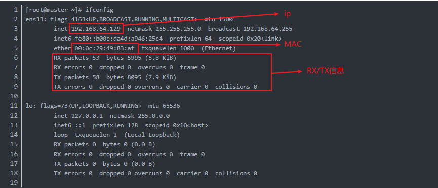
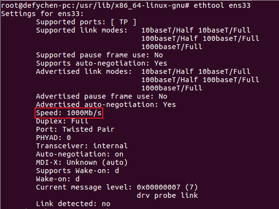

# xperf usage

## 1. iperf/iperf3

### 1.1 简介

iperf是一个网络性能测试工具,可测试TCP和UDP带宽质量、报告带宽、延迟抖动和数据包丢失.基于client-server模式工作.

iperf测试TCP的性能主要关注带宽:在client与server三次握手建立连接以后,在连接建立的期间,发送的总数据除以发送的总时间即为测得的带宽.

	TCP拥有窗口机制(windows),理论上窗口大小(windows size)为瓶颈带宽与往返时延的乘积.

iperf测试UDP的性能主要关注抖动和丢包率:client指定数据流的速度和packet大小,一般进行pps(packet per second)的测试.

### 1.2 iperf的安装

	sudo apt-get install iperf
	sudo apt-get install iperf3
	iperf --version
	iperf3 --version

### 1.3 参数说明

#### 1.3.1 服务器端

	iperf3 -s -i 1 -p 13000 &
	/*
		-s:表示server;
		-i(--interval):间隔1s返回报告;
		-p(--port):设置端口号13000;
		&:后台运行.
	*/

#### 1.3.2 客户端

	iperf3 -u -l 16 -b 100m -t 120 -c 192.168.0.1 -i 1 -p 13000 -A 0
	/*
		-u:使用udp而非tcp;
		-l(len):长度;
		-b:udp模式使用的带宽(bit/sec),只有-u才指定.默认1Mbit/sec;
		-t:传输时间(s);
		-c:client,后面紧跟ip地址;
		-A:设置CPU亲和性,将iperf3进程与逻辑CPU核绑定,避免进程在不同CPU间调度.
	*/

### 1.4 实例

#### 1.4.1 启动server

	iperf -s

#### 1.4.2 client连接

1.测试TCPU的带宽,测试时间10s

	iperf -c 127.0.0.1 -t 10 //在本机种进行测试,或者两台主机可以互相ping通即可测试

2.测试udp模式,连接30个线程,以5Mbps速率发送

	iperf -u -c 127.0.0.1 -b 5m -P 30 -t 60 //-P(--parallel):线程数,默认1线程

## 2. qperf

### 2.1 简介

qperf可以用于测试两个节点之间的带宽(bandwidth)和时延(latency),可以用于测试tcp/udp协议的性能指标.

### 2.2 qperf的安装

	sudo apt-get install qperf

### 2.3 参数说明

#### 2.3.1 服务器端启动

	qperf

#### 2.3.2 client端

	格式: qperf serverIP [options] TEST
	options为:
	-oo msg_size/-m:设置报文大小,默认测带宽为64KB,测延迟为1B;
	-vu(--version):显示更多输出信息,一般起帮助用的;
	TEST为:
	tcp_bw:TCP流带宽;
	tcp_lat:TCP流延迟;
	udp_bw:UDP流带宽;
	udp_lat:UDP流延迟;
	conf:显示两端主机配置.

### 2.4 实例

#### 2.4.1 启动服务器端

	qperf

#### 2.4.2 client端

1.测试TCP的带宽和时延

	qperf 127.0.0.1 tcp_bw tcp_lat

2.测试64K块TCP的带宽和时延,并输出块大小信息

	qperf 127.0.0.1 -oo msg_size:64K -vu tcp_bw tcp_lat

3.从1B开始按2的指数倍递增到64K,测试带宽和时延

	qperf 127.0.0.1 -oo msg_size:1:64K:*2 -vu tcp_bw tcp_lat

## 3. netperf

### 3.1 简介

netperf基于TCP/UDP传输,反映两个系统间发送和接收数据的速度.

### 3.2 安装

	sudo apt-get install netperf

### 3.3 参数说明

#### 3.3.1 server端

	netserver -p 49999 //需要选择一个未使用的端口,不然会报"Unable to start netserver with 
		'IN(6)ADDR_ANY' port '12865' and family AF_UNSPEC"

#### 3.3.2 client端

	-H/host:指定server IP地址;
	-l:测试的时间长度(s);
	-t:指定测试类型(TCP_STREAM, TCP_RR, TCP_CRR, UDP_STREAM, UDP_RR等)

### 3.4 实例

#### 3.4.1 服务器端

	netserver -p 49999

#### 3.4.2 client端

1.TCP_STREAM测试

	netperf -H 127.0.0.1 -l 10

2.UDP_STREAM测试

	netperf -H 127.0.0.1 -t UDP_STREAM -l 5

PS:其他类似.

## 4. MZ

### 4.1 MZ简介

MZ是一个用C语言开发的快速产生流量的工具,用户可以用它来发送几乎所有可能和不可能产生的包.它可以用来做如下事情:

```
1.流量产生器(比如高压的多点传送网络)
2.防火墙和IDS的穿透测试
3.网络中的DoS攻击
4.在网络软件或工具中发现bug
5.用大量的ping和端口扫描搜索攻击
6.测试在奇怪的环境下(如压力测试，畸形包)的网络行为
7.实验室里教学工具
```

MZ当前只有linux版本,没有windows版本.

### 4.2 安装

```
apt-get install mz
```

### 4.3 参数说明

```
-t	指定包类型(IP，UDP，TCP，ARP，BPDU，CDP，部分的ICMP，RTP,DNS和SYSLO)
-a	指定源mac
-b	指定目的mac
-A	指定源ip
-B	指定目的ip
-p	指定未加工的帧指定长度(随机字节数)
-P	指定ASCII字符有效载荷
-d	指定包的间隔(e.g. -d 50msec:每隔50ms发送一个包; -d 2s:每隔2s发送一个包)
-c	指定发包的数目(e.g. -c 100:发送100个包; -c 0:表示发无限的包)
-r	指定delay的时间为随机值
-f	从文件中读取ASCII的有效载荷
-F	从文件中读取16进制数字的有效载荷
-S	模拟方式:电线里不放任何数据,它通常与详细的模式(－v或者V)
```

### 4.4 实例

```
mz eth0 -t tcp -a "" -b "" -A "" -B "" -c 1
/*
	eth0:需要产生包所在机器的网卡名字,通过ifconfig查看得到
	-t tcp:产生tcp包
	-a "src_MAC":需要产生包所在机器的网卡MAC,通过ifconfig查看得到
	-b "tgt_MAC":需要发送到的机器的网卡MAC,通过ifconfig查看得到
	-A "src_ip":需要产生包所在机器的ip,通过ifconfig查看得到
	-B "tgt_ip":需要发到的机器的ip,通过ifconfig查看得到
	-c 1:发送一个包
*/
```



## 5. 查看网卡信息及网卡带宽

### 5.1 查看网卡信息

ifconfig/ifconfig -a信息解读(如上图所示结果)

```
ens33(其他如:eth0)里的信息:
	RX packets...:表示收到的正常的网络包信息;
	RX errors 0 dropped 0...:表示收到的包被dropped的信息;
	TX packets...:表示发送的网络包信息;
	TX errors 0 dropped 0...:表示发送的包被dropped的信息
lo里的信息用于记录自己访问自己的网卡信息,类似ens33.
```

### 5.2 ethtool查看网卡带宽



```
在图中:
	Speed: 1000Mb/s--->表示网卡速度,可知该网卡是千兆网卡.
```

## 6. tcpdump抓包

### 6.1 抓包工具作用及分类

#### 6.1.1 作用

```
1.捕获网络协议包
2.分析网络协议包
```

#### 6.1.2 分类

```
1.命令行工具--->e.g. tcpdump
2.图像界面工具--->e.g. wireshark
```

### 6.2 安装

```
apt-get install tcpdump	// 默认系统会安装
```

### 6.3 使用

#### 6.3.1 tcpdump -i

```
tcpdump -i eth0	// 监视指定网络接口的数据包.不指定网卡,默认会监视第一个网络接口.
```

